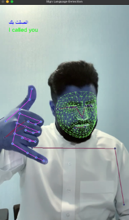
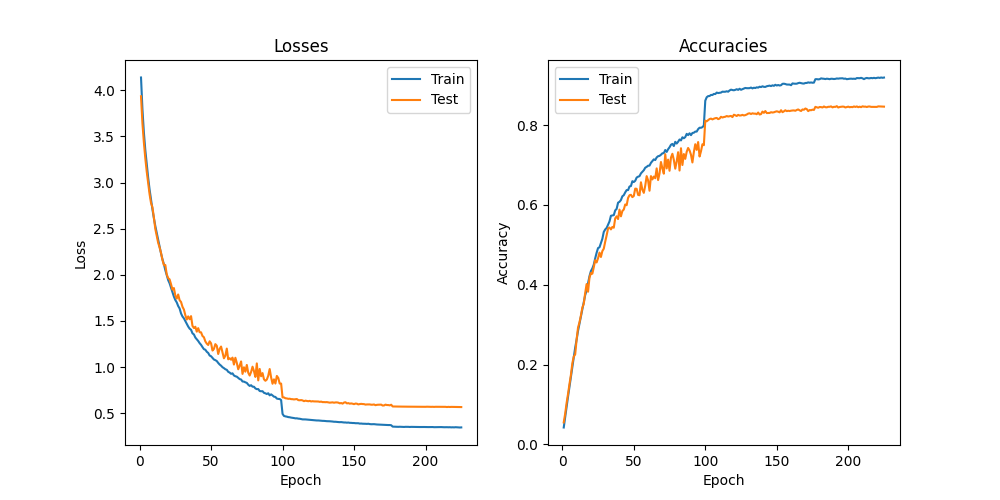
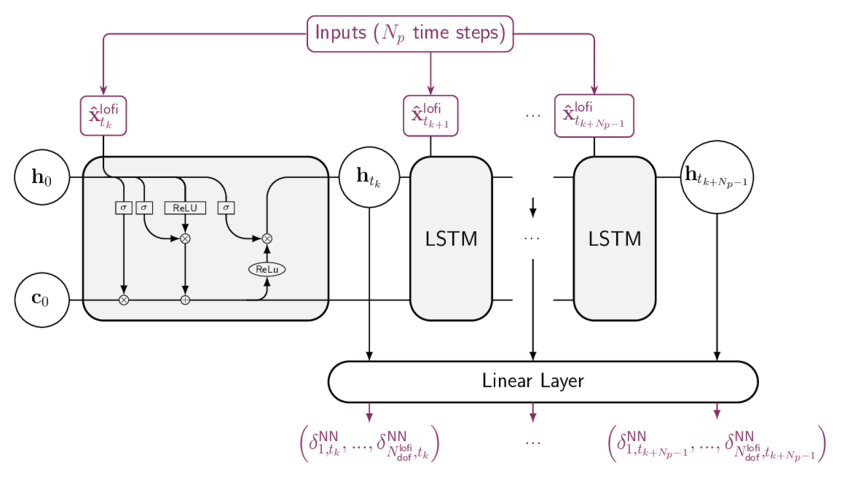
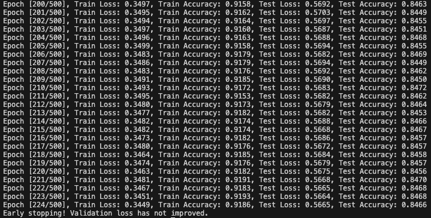

# Arabic Sign Language Recognition System

## Abstract

The Arabic Sign Language Recognition System aims to facilitate communication for individuals with hearing impairments by accurately interpreting Arabic sign language gestures in real-time. This project utilizes Python version 3.10 and provides detailed instructions to set up the development environment and train the recognition model. By leveraging keypoint extraction techniques and Long Short-Term Memory (LSTM) networks, the system achieves high accuracy in recognizing sign language gestures. 

## Setting Up the Development Environment

### Linux

To create a virtual environment in Linux, follow these steps:

1. Open your terminal.
2. Run the following command to create a virtual environment named `.venv`:
    ```bash
    python3 -m venv .venv
    ```
3. Activate the virtual environment by running:
    ```bash
    source .venv/bin/activate
    ```

### Windows

For Windows users, the process is slightly different:

1. Open Command Prompt.
2. Execute the following command to create a virtual environment named `.venv`:
    ```bash
    python -m venv .venv
    ```
3. Activate the virtual environment by running:
    ```bash
    .\.venv\Scripts\activate
    ```

#### About the Environment

Creating a virtual environment isolates your project's dependencies, ensuring that they do not interfere with other projects or the system-wide Python installation. This practice helps maintain clean and consistent development environments, making it easier to manage dependencies and collaborate with others.

## Workflow

1. **Environment Setup**: Users are guided to create a virtual environment using Python's venv module and install required packages from a provided `requirements.txt` file.
   
    To install the requirements, run the below command:
    ```bash
    pip install -r requirements.txt
    ```

2. **Keypoint Extraction**: The system extracts and saves keypoints from input sign language videos using the `save_keypoints.py` script.
   
    To extract keypoints from videos, execute:
    ```bash
    python save_keypoints.py
    ```

3. **Model Training**: Users can train the recognition model by running the `train.py` script. This step involves feeding the extracted keypoints into an LSTM architecture for model learning.
   
    To train the model, run:
    ```bash
    python train.py
    ```

4. **Model Testing**: The trained model can be tested using the `test.py` script. This enables users to evaluate the model's performance on unseen sign language gestures.
   
    To test the model in real-time using a pre-trained model, run:
    ```bash
    python test.py
    ```

5. **Evaluation with Single Video**: For comprehensive evaluation, users can utilize the `single_eval.py` script to analyze the model's performance on a single video input.
   
    To evaluate using a single video, specify the video path:
    ```bash
    python single_eval.py --video_path "data/اتصلت بك/test.mov"
    ```

## Image Recognition

  
The system employs LSTM for sign language gesture recognition. By converting input video frames into keypoints and feeding them into the LSTM architecture, the model effectively learns to identify and interpret Arabic sign language gestures.

## Preprocessing Model

  
The preprocessing step in the Arabic Sign Language Recognition System involves extracting keypoints from sign language videos. These keypoints serve as input data for training the recognition model. By preprocessing the input data, the system enhances the model's ability to accurately recognize sign language gestures.

## LSTM Model

The Arabic Sign Language Recognition System utilizes Long Short-Term Memory (LSTM) networks for gesture recognition instead of Convolutional Neural Networks (CNNs). LSTM networks are a type of recurrent neural network (RNN) architecture, well-suited for sequential data such as video frames. 

### Architecture


The LSTM model architecture consists of multiple LSTM layers followed by a dense layer for classification. Each LSTM layer processes sequential data, capturing temporal dependencies within the input gestures.

### Training and Testing

The model is trained and evaluated using the extracted keypoints from sign language videos. The training and testing performance, depicted in the provided plot, showcases the model's learning progress over epochs in terms of training and testing loss and accuracy.

## Dataset

The dataset consists of sign language videos captured from various individuals performing Arabic sign language gestures. The system utilizes this dataset to train and evaluate the recognition model, ensuring robust performance across different sign language expressions.

## Results and Accuracy

  
The project provides visual representations of training and testing performance, including graphs illustrating training and testing losses over epochs. Additionally, the system evaluates the model's accuracy using real-world sign language videos, providing insights into its effectiveness in real-time gesture recognition.

## Future Work

Future enhancements may include exploring advanced techniques such as GANs for dataset augmentation and improving model performance. Continuously updating and refining the dataset can further enhance the system's accuracy and effectiveness in recognizing Arabic sign language gestures.

# Sign-Language-Detection
